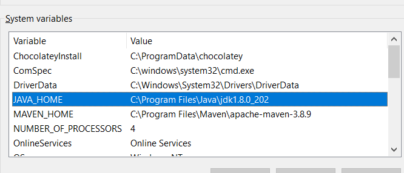
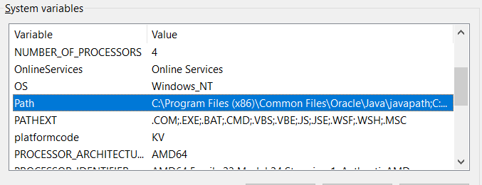
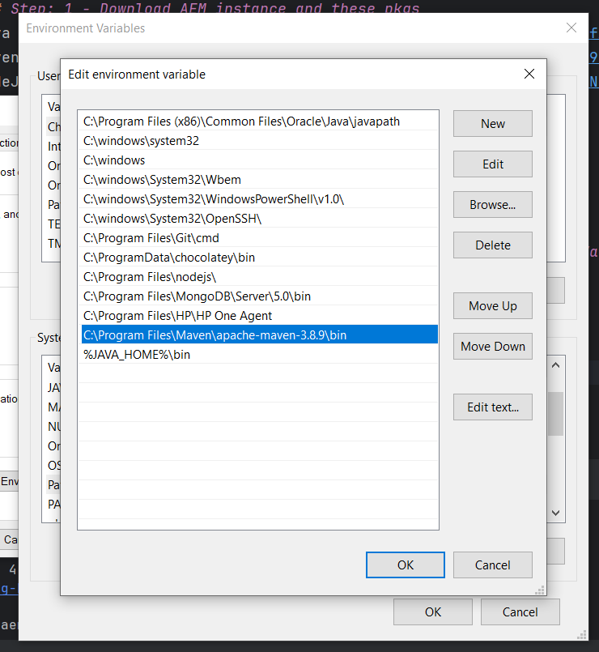
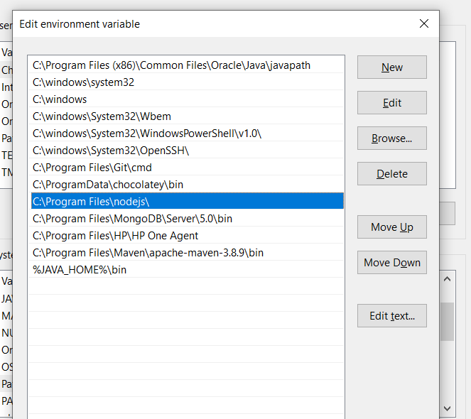
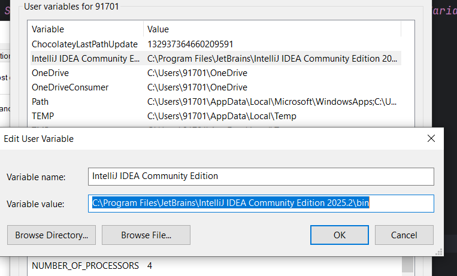
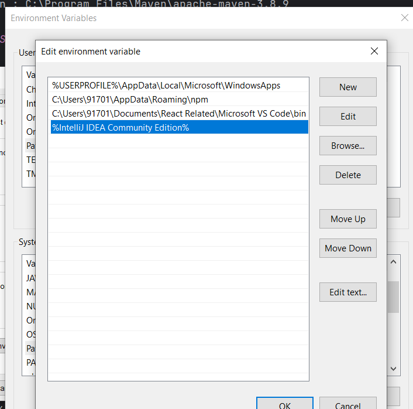

# **Bhargav Notes**

## **For all the code details**
com/aem/geeks/core/Bhargav-notes.txt

## **GIT Related**
### To Push The Code in to Git
git status                            
git add .                              
git commit -m "random commit"  
git push origin main

##### To check the status:
git status

##### to add the untracked file:
git add core/src/main/java/com/aem/geeks/core/Bhargav-notes.txt

## AEM Important Commands

#### STARTING AEM SERVER IN DEBUG MODE
`java -Xdebug -agentlib:jdwp=transport=dt_socket,server=y,suspend=n,address=8080 -jar aem-author-p4502.jar -gui
`

### Common Maven Commands for AEM
##### Build everything (all modules)
`mvn clean install`
- Run this from the root project folder (where the parent pom.xml is).
- Cleans (target/ folders) and rebuilds all modules (core, ui.apps, ui.content, all).
- Doesn’t deploy to AEM, just builds JARs/ZIPs in target/.

##### Build and Deploy to AEM
`mvn clean install -PautoInstallSinglePackage`
- Use this when you want to build the whole project and install the full package (all module) into your local AEM instance.
- Useful for fresh deployments.

##### Build and Deploy Only One Module
1. Core module (OSGi bundle):
`--> cd core
mvn clean install -PautoInstallBundle`
- Deploys only the core bundle (Java code) to AEM.
- Faster than full build when you just changed backend Java code.
- UI modules (frontend / components):
  cd ui.apps
  mvn clean install -PautoInstallPackage
  or
- cd ui.content
  mvn clean install -PautoInstallPackage

- Deploys only that module’s package (JS, HTL, dialogs, content, etc.).
- Faster if you only changed frontend code, dialogs, or content.

##### Skip Tests for Faster Builds
`mvn clean install -DskipTests`
-Useful if you know tests are passing and want quicker builds.

Combine with deploy:
`mvn clean install -PautoInstallSinglePackage -DskipTests`

##### Deploy Manually Built Package
If you don’t want Maven auto-deploy:
Build: mvn clean install
Find the all package in:
all/target/*.zip
Upload it via AEM Package Manager (http://localhost:4502/crx/packmgr).

### **To Setup the AEM Instance**

#### Manditory Packages

##### Step: 1 - Download AEM instance and these pkgs
* Java - https://drive.google.com/file/d/1iHlFc8p2RMhBcjT0Pc-5PHDyk65P1fAO/view?usp=drive_link
* Maven - https://drive.google.com/file/d/1tEkH3D-5x7qXLGkQli19wR0_H2xr9CFa/view?usp=drive_link
* NodeJs - https://drive.google.com/file/d/1nBOG65PiYltc7va_ESLZU5HgxU0NsCb_/view?usp=drive_link

###### Sample locations to place the files
* Node : C:\Program Files\nodejs
* Java : C:\Program Files\Java\jdk1.8.0_202\jre
* Maven : C:\Program Files\Maven\apache-maven-3.8.9

##### Step: 2 - after installing the above packages Setup Environment Variables

* Java, Maven
1. 
2. Go to path and edit 
    

3. And add that java and maven inside path like this
   

4. Add Nodejs also similarly
    

Note :  add for intellij also
1. 
2. Add it in the path as well
    

**___________________BHARGAV Notes Ends_________________**

# **AEM GEEKS NOTES - start**

# Sample AEM project template

This is a project template for AEM-based applications. It is intended as a best-practice set of examples as well as a potential starting point to develop your own functionality.

## Modules

The main parts of the template are:

* core: Java bundle containing all core functionality like OSGi services, listeners or schedulers, as well as component-related Java code such as servlets or request filters.
* ui.apps: contains the /apps (and /etc) parts of the project, ie JS&CSS clientlibs, components, templates, runmode specific configs as well as Hobbes-tests
* ui.content: contains sample content using the components from the ui.apps
* ui.tests: Java bundle containing JUnit tests that are executed server-side. This bundle is not to be deployed onto production.
* ui.launcher: contains glue code that deploys the ui.tests bundle (and dependent bundles) to the server and triggers the remote JUnit execution
* ui.frontend: an optional dedicated front-end build mechanism (Angular, React or general Webpack project)

## How to build

To build all the modules run in the project root directory the following command with Maven 3:

    mvn clean install

If you have a running AEM instance - To build and package the whole project and deploy into AEM with

    mvn clean install -PautoInstallPackage

Or to deploy it to a publish instance, run

    mvn clean install -PautoInstallPackagePublish

Or alternatively

    mvn clean install -PautoInstallPackage -Daem.port=4503

Or to deploy only the purticular bundle to the author, run

    mvn clean install -PautoInstallBundle

## Testing

There are three levels of testing contained in the project:

* unit test in core: this show-cases classic unit testing of the code contained in the bundle. To test, execute:

    mvn clean test

* server-side integration tests: this allows to run unit-like tests in the AEM-environment, ie on the AEM server. To test, execute:

    mvn clean verify -PintegrationTests

* client-side Hobbes.js tests: JavaScript-based browser-side tests that verify browser-side behavior. To test:

    in the browser, open the page in 'Developer mode', open the left panel and switch to the 'Tests' tab and find the generated 'MyName Tests' and run them.

## ClientLibs

The frontend module is made available using an [AEM ClientLib](https://helpx.adobe.com/experience-manager/6-5/sites/developing/using/clientlibs.html). When executing the NPM build script, the app is built and the [`aem-clientlib-generator`](https://github.com/wcm-io-frontend/aem-clientlib-generator) package takes the resulting build output and transforms it into such a ClientLib.

A ClientLib will consist of the following files and directories:

- `css/`: CSS files which can be requested in the HTML
- `css.txt` (tells AEM the order and names of files in `css/` so they can be merged)
- `js/`: JavaScript files which can be requested in the HTML
- `js.txt` (tells AEM the order and names of files in `js/` so they can be merged
- `resources/`: Source maps, non-entrypoint code chunks (resulting from code splitting), static assets (e.g. icons), etc.

## Maven settings

The project comes with the auto-public repository configured. To setup the repository in your Maven settings, refer to:

    http://helpx.adobe.com/experience-manager/kb/SetUpTheAdobeMavenRepository.html
